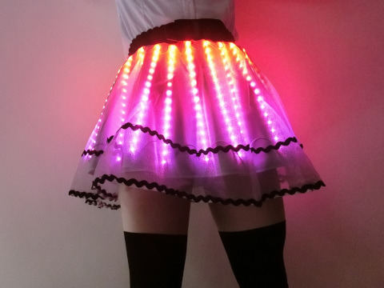
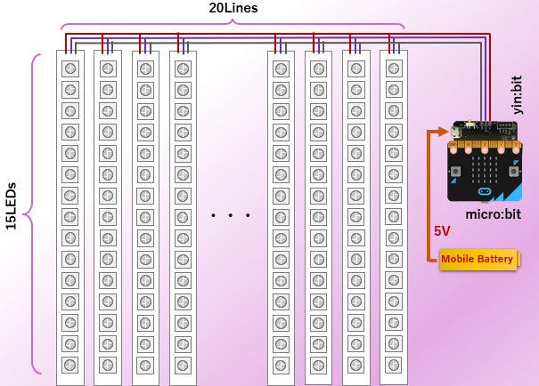
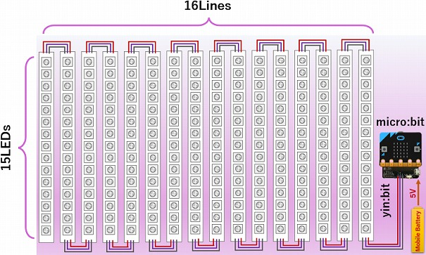
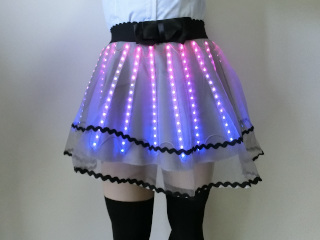
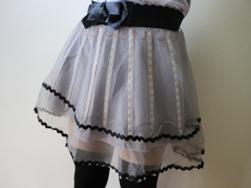
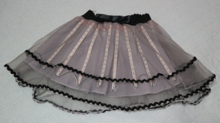
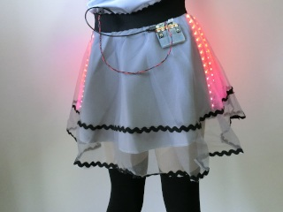

Gaming Skirt
=========

This is the project of an illumination module for skirt.

## Features

+ Controlled by micro:bit
+ 300 (ver.1: 240) full colour LEDs

## Configuration

### Ver. 2 (December 2019)

### Ver. 1 (May 2019)

## Principal electronic parts list

|electronic parts|unit price [JPY]|quantity|total [JPY]|
|:-----------|------------:|:------------:|------------:|
|[micro:bit](https://microbit.org/)|2,138|1|2138|
|[yin:bit ver.1.0](https://github.com/GomiHgy/yin_bit)|1,500|1|1,500|
|[Full colour serial LED tape (1m)](https://www.switch-science.com/catalog/1399/)|2,970| 5 (ver.1: 4)|14,850 (ver.1: 11,880)|

## Files in this Project

### Ver. 2 (December 2019)

+ source/GamingSkirt_Radio.py --- Illumination using Wireless Communication

### Ver. 1 (May 2019)

+ source/microbit_neopixel_test.py --- test program
+ source/IlluminatedSkirtDemo.py --- Illumination Demo program
+ source/IlluminatedSkirt_Accelerometer.py --- Illumination Demo program using Accelerometer

## Pictures

### Ver. 1 (May 2019)

[Illuminated Skirt](img/IlluminatedSkirt1.jpg)  

[Power OFF](img/IlluminatedSkirt2.jpg)  

[not weared](img/IlluminatedSkirt3.jpg)  

[Back](img/IlluminatedSkirtBack.jpg)  

## Videos

### Ver. 1 (May 2019)

[Watch video on Nico-video](https://www.nicovideo.jp/watch/sm35141886)

